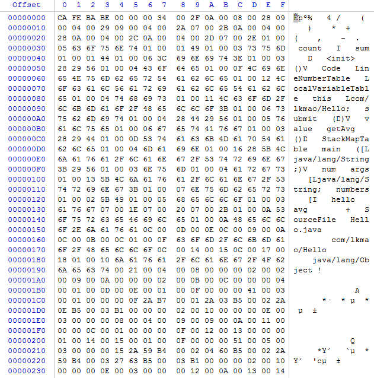
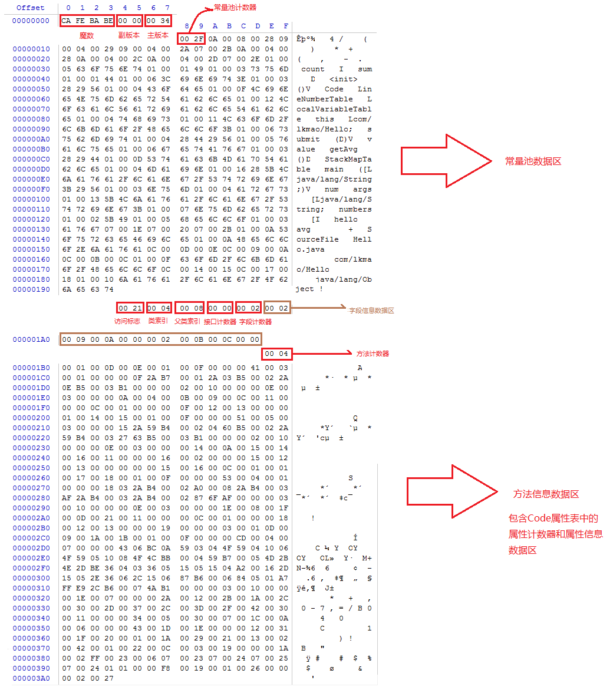

# 第一次课(20210106)

## 自己写一个简单的Hello.java,里面需要涉及基本类型，四则运算，if和for循环，然后自己分析一下对应的字节码文件。

### Hello.java源码文件(选取课程代码)

```java
/**
 * Hello源文件文件
 *
 * @author Lkmao
 */
public class Hello {
    private int count = 0;
    private double sum = 0.0D;

    /**
     * 向一个求和sum算术加一个数
     *
     * @param value 需要算术加的数值
     */
    public void submit(double value) {
        this.count++;
        this.sum += value;
    }

    /**
     * 求取平均数
     *
     * @return 平均数值
     */
    public double getAvg() {
        if (0 == this.count) {
            return sum;
        }
        return this.sum / this.count;
    }

    /**
     * 测试main方法
     *
     * @param args
     */
    public static void main(String[] args) {
        int[] numbers = {1, 6, 8};
        Hello hello = new Hello();
        for (int num : numbers) {
            hello.submit(num);
        }
        double avg = hello.getAvg();
    }
}
```

### 使用WinHex打开Hello.java编译后的字节码即class文件

字节码文件截图:



字节码结构组织:



简单总结分析，Class文件是一组以8个字节为基础单位的二进制流，各个数据项严格按照顺序紧凑地排列在文件之中，中间没有任何分隔符，这样字节码中的数据项无论是顺序还是数量，甚至于数据存储的字节序都被严格的限定，哪个字节代表什么含义，长度多少，先后顺序如何，全部都不允许改变。先后由魔数、版本号、常量池计数器、常量池数据区、访问标志、类索引、父类索引以及接口、字段、方法、属性信息等等。

### 使用javap -v Hello.class指令查看


## 自定义一个ClassLoader,加载一个Hello.xlass文件，执行hello方法，此文件类容是一个Hello.class文件所有字节(x=255-x)处理后的文件。

答案链接源码(https://github.com/maolikui/JAVA-01/tree/main/Week_01/code/Week_01)

## 画一张图，展示 Xmx、Xms、Xmn、Metaspache、DirectMemory、Xss 这些内存参数的关系。

### JVM简要架构


### 内存参数关系


## 检查一下自己维护的业务系统的 JVM 参数配置，用 jstat 和 jstack、jmap 查看一下详情，并且自己独立分析一下大概情况，思考有没有不合理的地方，如何改进。

该题目选用启动Nacos Server程序

### jstat:监视虚拟机各种状态运行状态信息

每隔250ms 打印进程id为10208的gc情况，打印10次停止。


显示ClassLoader相关信息


每隔5s打印进程id为10208的gc情况，打印10次停止(各区域数据显示已使用的百分比)


### jinfo :实时查看和调整虚拟机各项参数

查看-Xmx参数值


### jmap:生成堆转储快照


默认情况下，在内存大于1G的，-Xmx为pc内存的1/4，-Xmn为堆内存的1/3。启动了UseAdaptiveSizePolicy情况下Eden和Survivor会动态调整。

禁用AdaptiveSizePolicy,指定-Xmx和-Xms为4g后，Eden和S0,S1接近8:1:1,如下图所示：


### jstack: 生成虚拟机当前时刻的线程快照

并可以通过jstack -l 13872 | grep 'java.lang.Thread.State' | wc -l 统计线程数量


# 第二次课(20210110)

## 本机使用 G1 GC 启动一个程序，仿照课上案例分析一下 JVM 情况

该题选用启动Nacos server程序,启动命令如下

```
java -Xmx4g -Xms4g -XX:+UseG1GC -jar nacos-register.jar
```

通过jmap -heap pid可以得到如下结果：


通过查看堆使用情况，堆不再分为年轻代和老年代，而是划分成多个region。在逻辑上所有的Eden区和Survivor区组成年轻代，所有的Old区组成老年代。

**jinfo -flag G1HeapRegionSize pid** 获取每隔Region大小，默认设置为2M。

**jinfo -flag GCTimeRatio pid** 默认是9，计算花在Java应用线程上和花在GC线程的时间比率。

**jinfo -flag MaxGCPauseMillis pid** 默认200，预期G1每次执行GC操作的暂停时间。

