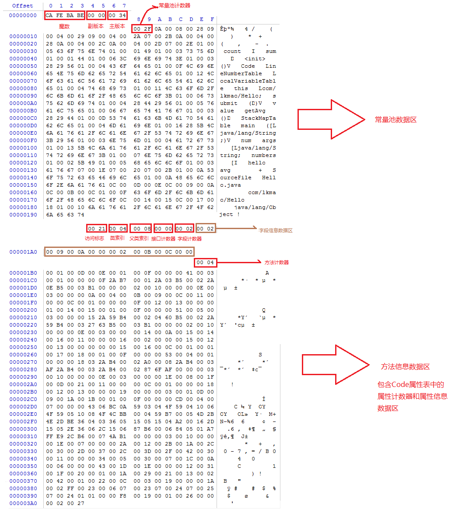
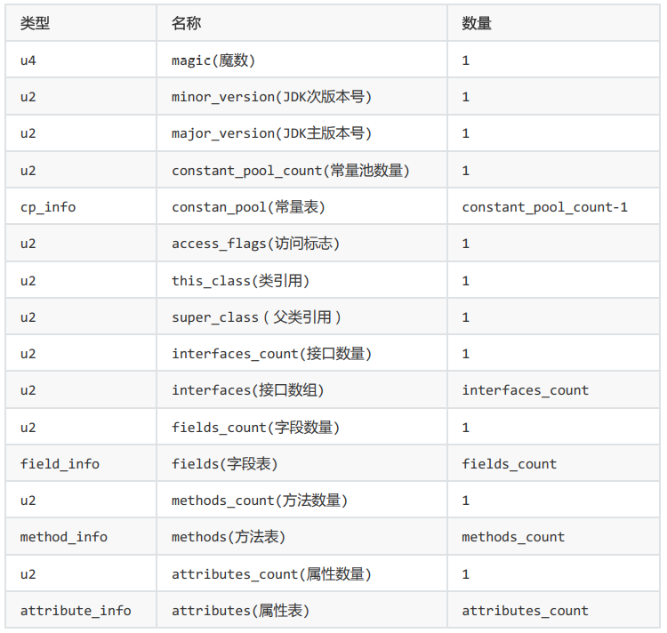
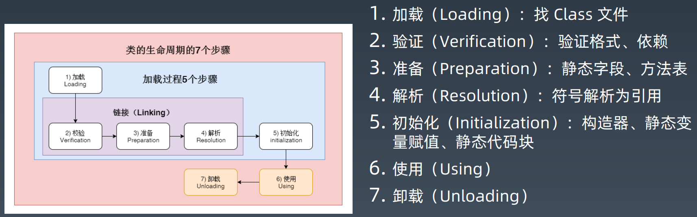
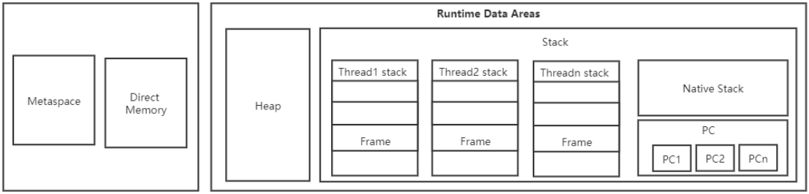
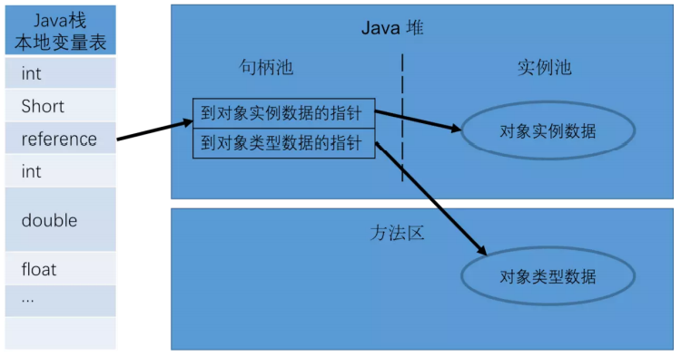
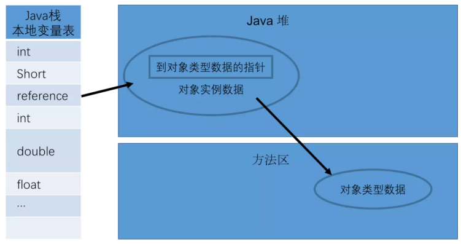
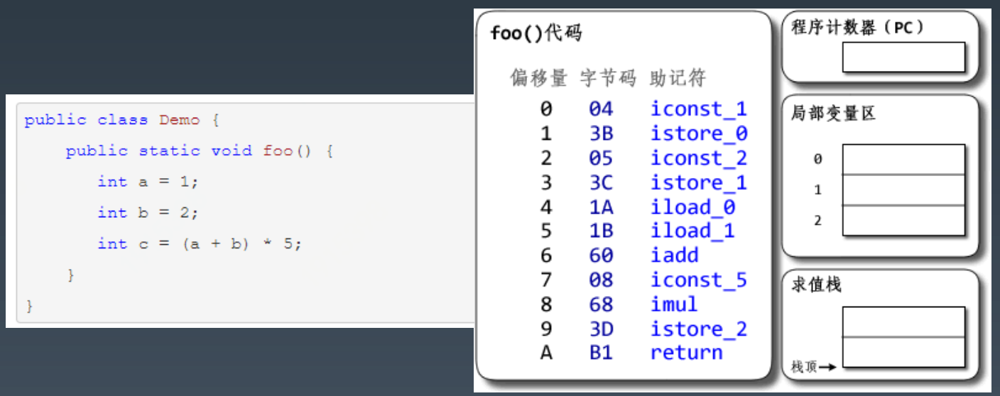

​        通过本周课程学习，进一步加深了对JVM的认识，提升了对Java知识点的理解。从字节码文件的组织结构，到类加载进入内存的不同阶段，再到运行时数据区域的划分，以及方法在调用执行时线程栈结构中的变化，再到垃圾回收的原理以及实战演练，最后提升到JVM的优化，不断地填充完善JVM知识体系结构。对各个模块进行简要总结，并针对典型问题进行记录说明。

# 字节码文件组织结构

可以结合作业题目，加深理解记忆。

## 宏观组织结构是什么样子的？

字节码文件组织结构：

提取概括成如下表格：

## Class文件constant pool ,运行时常量池和字符串常量池的区别是什么样的？

- class常量池中存储的是符号引用，而运行时常量池存储的是被解析之后的直接引用。

- class常量池存在于class文件中，运行时常量池和字符串常量池是存在于JVM内存中。

- 运行时常量池具有动态性，java运行期间也可能将新的常量放入池中(String#intern())
- 字符串常量池逻辑上属于运行时常量池的一部分，但是它和运行时常量池的区别在于，字符串常量
  池是全局唯一的，而运行时常量池是每个类一个。(字符串常量池是按照**String table**(hash table)组织的)

jdk1.6及以前 运行时常量池是方法区的一部分 

jdk1.7 运行时常量池移入堆中

jdk1.8 方法区换成了Metaspace

## Class文件中的符号引用什么时候替换成直接引用的？

​        一般情况下，符号引用替换为直接引用的操作发生在类加载过程(加载 -> 连接(验证、准备、解析) -> 初始化)中的解析阶段，会将符号引用转换(替换)为对应的直接引用，放入运行时常量池中。

# 类加载子系统

## 类的生命周期(借用教案说明)

## 类加载的时机一般发生在什么时候？

结合课程总结：

1. 当虚拟机启动时，初始化用户指定的主类，就是启动执行的 main 方法所在的类；
2. 当遇到用以新建目标类实例的 new 指令时，初始化 new 指令的目标类，就是 new
一个类的时候要初始化；
3. 当遇到调用静态方法的指令时，初始化该静态方法所在的类；
4. 当遇到访问静态字段的指令时，初始化该静态字段所在的类；
5. 子类的初始化会触发父类的初始化；
6. 如果一个接口定义了 default 方法，那么直接实现或者间接实现该接口的类的初始化，
会触发该接口的初始化；
7. 使用反射 API 对某个类进行反射调用时，初始化这个类，其实跟前面一样，反射调用
要么是已经有实例了，要么是静态方法，都需要初始化；
8. 当初次调用 MethodHandle (**方法句柄**)实例时，初始化该 MethodHandle 指向的方法所在的类。

## 为什么要使用双亲委派模型？为什么需要破坏双亲委派模型？

可以避免重复加载，当父亲已经加载了该类的时候，就没有必要子ClassLoader再加载一次。在某些情况下父类加载器需要加载的class文件由于受到加载范围的限制，父类加载器无法加载到需要的文件，这个时候就需要委托子类加载器进行加载。

# 运行时数据区

采用课程作业中的运行时数据区截图

## 对象的内存布局是什么样的？

对象在内存中存储的布局可以分为三块区域：对象头（Header），实例数据（Instance Data）和对齐填充（Padding）。

## 对象的访问方式有哪些?

通过句柄访问，稳定，对象被移动只要修改句柄中的地址。

通过直接指针访问，快速，节省了一次指针定位的开销。

# 方法调用和方法执行

借用教案截图

程序计数器记录线程执行的代码行号，局部变量表随着程序的运行存储局部变量，操作栈帮助处理运算。

## 谈谈对方法重载和方法重写的理解？

摘抄自网络分享：

**重载和重写** 
	同一个类中，如果出现多个名称相同，并且参数类型相同的方法，将无法通过编译。因此，想要 在同一个类中定义名字相同的方法，那么它们的参数类型必须不同。这种方法上的联系就是重载。

**重载的方法在编译过程中即可完成识别**。具体到每一个方法调用，Java编译器会根据所传入参数的声明 类型(有别实际类型)来选取重载方法。 

选取过程如下： 

1. 不考虑对基本类型自动装拆箱(auto-boxing，auto-unboxing)，以及可变长参数的情况下选取 重载方法;
2.  如果1中未找到适配的方法，则允许自动装拆箱，但不允许可变长参数的情况下选取重载方法; 
3. 如果2中未找到适配的方法，则在允许自动装拆箱以及可变长参数的情况下选取重载方法. 

 那么，如果子类定义了与父类中非私有方法同名的方法，而且这两个方法的参数类型相同，那么 这两个方法之间又是什么关系呢？

 如果这两个方法都是静态的，那么子类中的方法隐藏了父类中的方法。 如果这两个方法都不是静态的，且都不是私有的，那么子类的方法重写了父类中的方法。 

众所周知，Java 是一门面向对象的编程语言，它的一个重要特性便是**多态**。而方法重写，正是多态最 重要的一种体现方式：它允许子类在继承父类部分功能的同时，拥有自己独特的行为。

## 谈谈对JVM静态绑定和动态绑定的认识？

摘抄自网络分享：

把一个【方法】与其所在的【类/对象】关联起来叫做方法的绑定。方法绑定分为静态绑定（前期绑 定）和动态绑定（后期绑定）。

**静态绑定**

Java虚拟机中的静态绑定(static binding)指的是在解析时便能够直接识别目标方法的情况；在程序运行前就已经知道方法是属于那个类的，在编译的时候就可以连接到类的中，定位到这个方法。 在Java中，final、private、static修饰的方法以及构造函数都是静态绑定的，不需程序运行，不需 具体的实例对象就可以知道这个方法的具体内容。

**动态绑定** 

 动态绑定(dynamic binding)则指的是需要在运行过程中根据调用者的动态类型（具体的实例对 象）来识别目标方法的情况。 动态绑定是多态性得以实现的重要因素，它通过**方法表**来实现：每个类被加载到虚拟机时，在方法区保存元数据，其中包括一个叫做方法表（method table）的东西，表中记录了这个类定义的方法的指 针，每个表项指向一个具体的方法代码。如果这个类重写了父类中的某个方法，则对应表项指向新的代码实现处。从父类继承来的方法位于子类定义的方法的前面。

分为编译阶段和运行阶段去分析。编译阶段是确保方法的存在性，保证程序能顺利、安全运行。实际运行阶段是调用直接引用对象方法。

# GC

参考课程问答一并进行操作理解。(操作与思考)

## 判断算法

引用计数和可达性分析算法

## 回收收集算法

复制、标记清除、标记整理等算法。

## 垃圾回收器

jdk5-jdk8 默认并行GC,JDK8-jdk15默认G1

