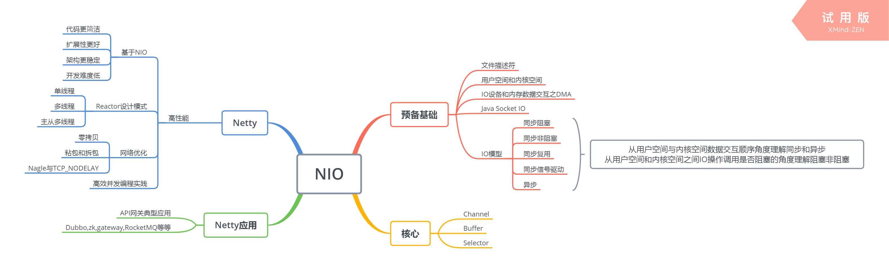
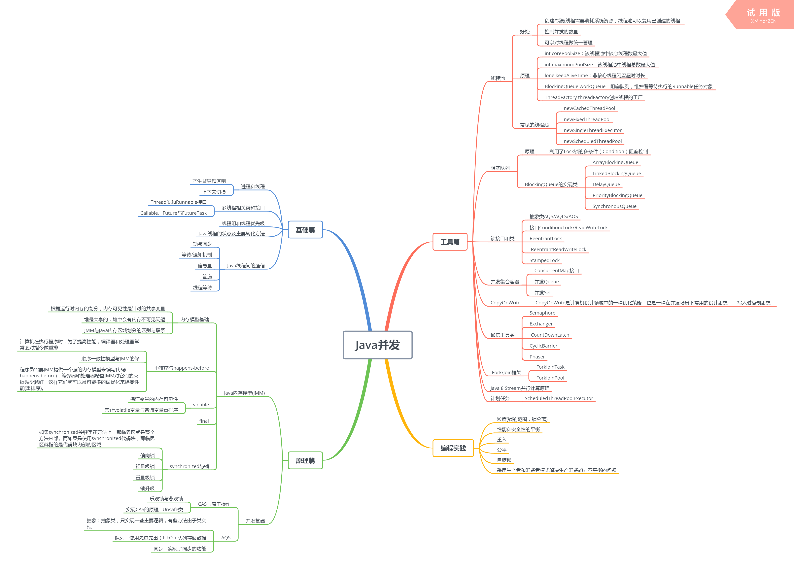
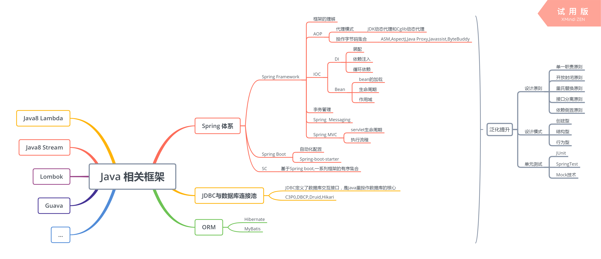
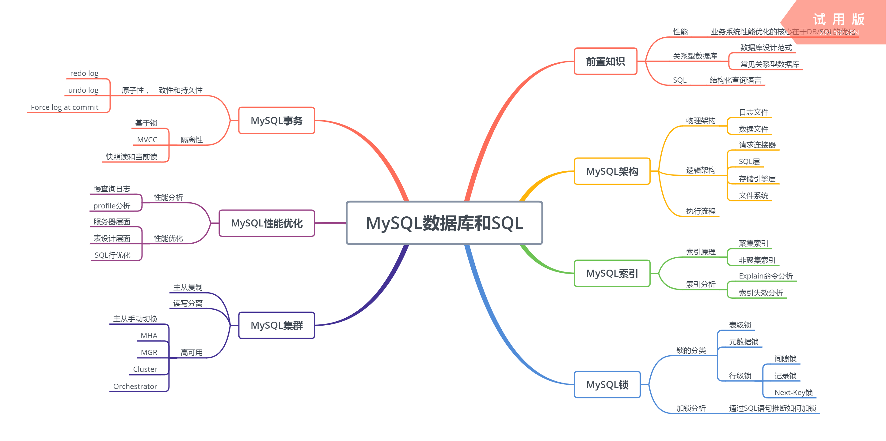
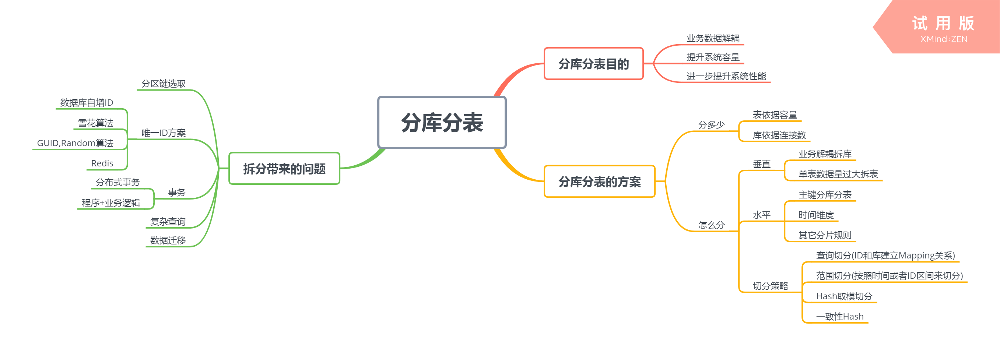
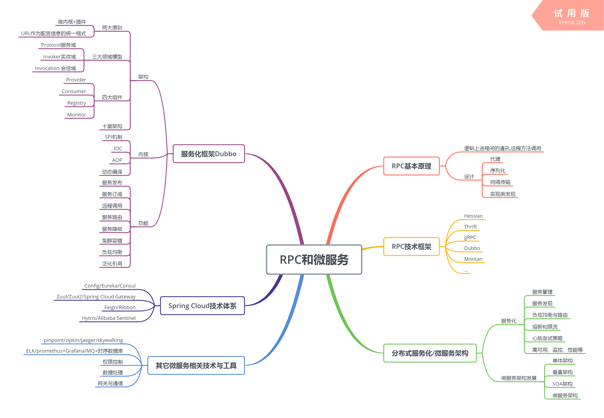
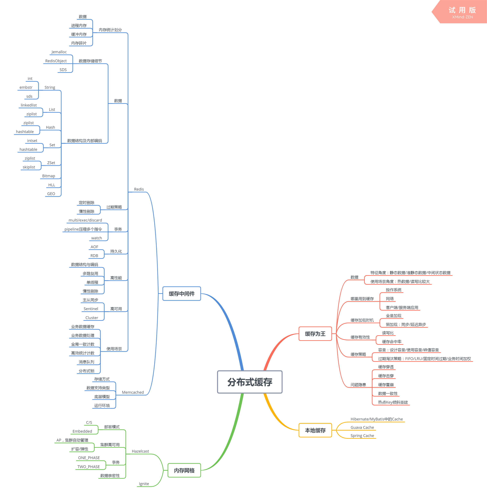
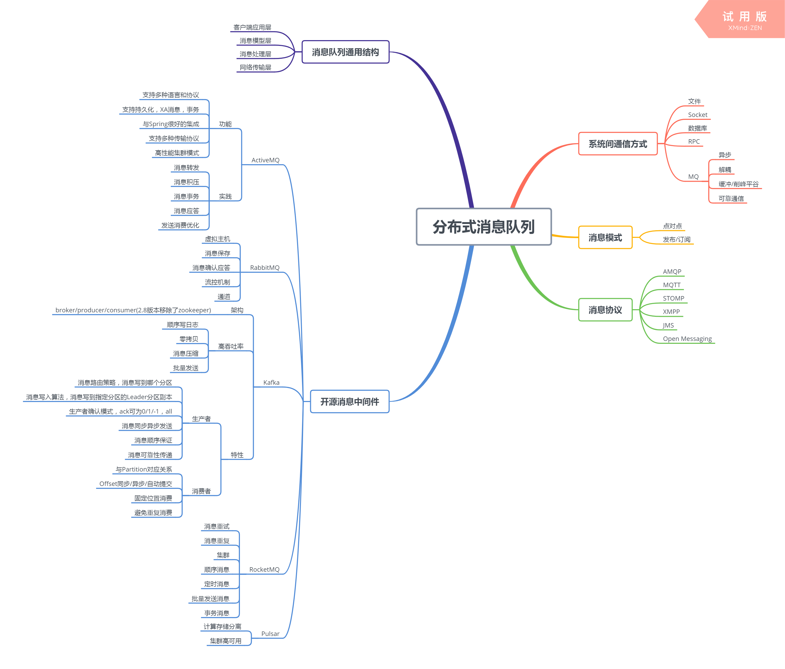

# JVM

按照Java应用程序执行的一般过程，将JVM模块拆解为如下若干步骤，以便在聊到JVM技术或者在实践应用中
知道技术点所在的大致位置：
1.编写好的Java文件经过编译器编译为Class字节码文件
2.字节码文件通过类加载器加载
3.经过类加载器加载后，实例分布在运行时数据区中
4.依照程序进行方法调用和方法执行
5.伴随程序运行过程中会发生GC

从功能的角度可以划分成内存管理，GC,虚拟机执行子系统等模块。个人的工作不会涉及到JVM源码层面的开发，大部分情况下会涉及JVM的启动参数配置，这可以类比大部分框架和中间件，基本上都会开放很多配置参数，可以根据实际的业务场景进行合理配置。理解和掌握原理层面的知识，有助于开发人员进行更好的编程实践。通过对GC日志，JVM线程堆栈以及内存等信息进行解读分析，基于CPU，内存和网络带宽等层面，实现性能的优化。

# NIO

传统的Java Socket IO服务端处理线程一旦阻塞，就不能建立新的连接，如果通过多线程异步的方式去处理，一方面大量线程的创建和销毁会产生很大的开销，另一方面系统的线程资源是宝贵的且有上限，因此不能从根本上解决满足大量客户端同时访问的问题。IO的调度模型是操作系统层面的描述，包括同步阻塞，同步非阻塞，同步复用IO,同步信号驱动，异步IO模型。JDK中提供了对NIO的封装,基于同步非阻塞IO模型部分，把多个I/O的阻塞复用到select的阻塞上，即使在单线程的情况下可以同时处理多个客户端请求。高性能的网络框架Netty基于NIO实现，使用了零拷贝的技术，高效的并发编程极大提升了性能。

# 并发编程

如同多进程解决了操作系统内的并发问题一样，多线程解决了进程内的并发问题。在多核和分布式的时代，多线程编程能够充分利用多核的优势，提升效率。然而操作系统的线程资源是有限的，并且线程频繁的创建和销毁以及切换都会产生很大的开销，不容易管理，此外线程之间如何进行同步，对共享资源如何安全访问，如何编程实践使应用程序拥有更高的性能等等问题给并发编程带来挑战。池化模式的应用，可以设计出符合业务场景的线程池，对多线程进行管理。JDK并发包也提供了同步锁机制,并发原子类，并发工具类，线程安全容器等相关工具，以便高效的并发编程。通过对JDK并发包的解读，可以加深对多线程的理解。

# Spring和ORM框架

Spring体系经过多年的发展逐渐庞大。Spring framework提供IOC和AOP的核心能力，将业务bean交给Spring容器去管理，使得编程开发变得简洁，通过三级缓存解决了循环依赖问题，并对外提供多种配置Bean实例生成的方式，面向切面编程则增加一个中间代理层来实现对象的托管，并且封装了Web应用MVC的实现，提供了一种清晰的分离模型。Spring Boot框架基于约定大于配置的原则变得简单，通过自动装配自动创建业务中需要使用的bean交给Spring容器管理。ORM解决对象关系的映射，提供了一种持久化的模式，能够高效的对数据库进行访问。

# MySQL数据库和SQL

平时开发的业务系统，系统性能优化这一块关于数据库层面的优化占有很大的比例。数据库与应用服务器分离署，在一定程度上可以提升性能。针对具体的数据库可以在配置，设计，SQL等层面进行合理的优化。随着数据量增大，并发访问量的增加以及系统可用性要求的提升，单机MySQL将面临容量有限，读写压力以及可用性不足的问题。分别可以通过分库分表，主从配置读写分离，提供failover能力等技术解决。

# 分库分表

分库分表解决了单节点数据库或者主从架构的数据库集群容量有限，无法扩容的问题，降低了单个节点数据库的写压力，增加了系统的数据容量。业务数据解耦，数据库垂直拆分；数据分片，数据库水平拆分。分多少，怎么分需要分别结合业务场景和架构设计的要求合理设置规则策略。当然拆分同样会带来唯一id,数据迁移和分布式事务等热点的问题。

# RPC和微服务

服务化之前业务之间一般都是通过本地API进行调用，服务化之后服务提供者和消费者之间通过远程网络通信。要求业务服务做到合理拆分，服务化框架具备高性能RPC能力。为了丰富完善服务化体系，服务化框架需要提供服务治理的功能，能够管理集群服务，实现服务注册和发现，路由和负载均衡，过滤和流控，心跳重试以及具备高可用，便于监控性能。

# 分布式缓存

"计算机科学领域的任何问题都可以通过增加一个间接的中间层来解决。"针对系统各级处理速度不匹配的问题，通过使用缓存，利用空间换时间来解决。比如计算机系统中CPU和内存之间的多级缓存来优化CPU处理速度和内存存取速度不一致的问题；网络传输过程中如果发送的数据过快，会造成数据丢失，可以通过增加缓冲区解决；利用Double Buffer可以解决图形图像显示过程中复杂耗时的计算与图形展示获取数据速度不匹配而造成的图像闪烁不连贯显示的问题等等。项目架构中可以选择使用本地缓存和远程缓存来提升系统的性能，设计过程中要考虑数据容量和过期处理策略的问题。使用缓存带来便利的同时，使用方式不当也同样会造成严重的问题，比如缓存穿透，缓存击穿，缓存雪崩和缓存数据一致性问题。

# 分布式消息队列

''计算机科学邻域的任何问题都可以通过增加一个间接的中间层来解决''，MQ作为分布式系统的基石之一，可以解决系统间的通信问题。MQ具备异步，解耦，流量削峰，提供可靠通信的作用。从系统间通信过程的角度来看，生产者生产消息不能丢失，需要得到可靠性的保证，消费者消费消息不能重复消费，有的业务场景还需要确保消息的顺序性。从系统架构的角度，单节点部署会存在单点问题，通过集群可以实现高可用，消息的写入需要一定的路由策略和算法，分区间的消息需要进行高效可靠的同步。通过日志顺序写入，零拷贝，批量发送和消息压缩等手段实现MQ的高吞吐率。同一个节点相同Topic不同的分区方便扩容，不同节点的分区持久化备份保证消息的可靠性。

